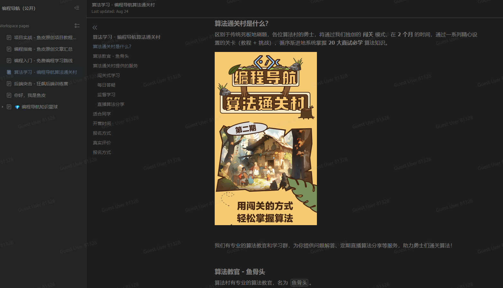

# 似水流年
## 随记
### 2023.8.28
&nbsp;&nbsp;&nbsp;一个冷知识，现在离2028年比2018年更近。。。
 

&nbsp;&nbsp;&nbsp;今天是编程导航算法通关村，开营的第一天。
一个好开始显然是很重要的，幸运的是，上午摸鱼时间已经看完第零关以及第一关青铜挑战的内容了。
那么考虑第一关的青铜打卡了。推荐的打卡方式是csdn博客，个人觉得吧，传到csdn略显臃肿了，考虑用语雀。
 

&nbsp;&nbsp;&nbsp;小可惜，语雀文档公开的话居然需要开会员，看来语雀的产品经理不屑于互联网公开引流。
没办法语雀，确实做的很好，但是公开文档需要开会员，这，这，这。我只能忍痛选择其他的笔记软件了。
一贯摆烂的我，平常自然也没有记笔记的习惯，用过的也只有有道笔记、wolai还有语雀了。
知乎搜一下，什么飞书、石墨、Notion、印象笔记等等，最终我还是决定，没错，就是github哈哈哈。

&nbsp;&nbsp;&nbsp;不能说对git陌生吧，但确实是不怎么熟悉。也没建个人仓库，整理一下技术资料啥的，
平常使用的也不多，最多就是搜一下有趣的轮子。想了想，整理一些笔记啥的放在github上面，还是挺有必要的。
前年开始写的csdn博客，笑死了，前年发了两篇，去年发了两篇，今年还没有发。。。。
嗯，粉丝量还破三位数了，可喜可贺（其实是我设定了粉丝才能观看全文，哈哈哈哈哈哈）。

&nbsp;&nbsp;&nbsp;希望可以坚持打卡吧，学习毕竟是个持续性的状态。真的很想很想摆烂，
可是这个社会就是这样。很卷，只有卷一点才能生活的更好，这样子。

&nbsp;&nbsp;&nbsp;另外，算法通关村是什么？

