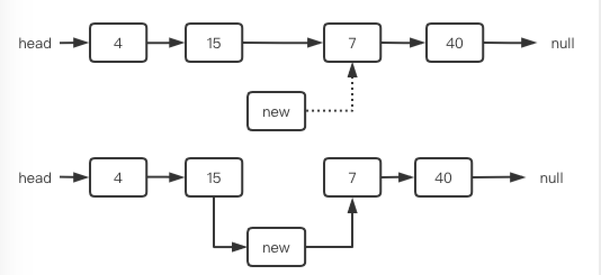

##什么是链表？

&nbsp;&nbsp;&nbsp;链表（linked list）是一种在物理上非连续、非顺序的数据结构，
由若干节 点（node）所组成。
单向链表的每一个节点又包含两部分，
一部分是存放数据的变量data，另一部 分是指向下一个节点的指针next。
双向链表比单向链表稍微复杂一些，它的每一个节点除了拥有data和next指针，
还拥有指向前置节点的prev指针。

&nbsp;&nbsp;&nbsp;如果说数组在内存中的存储方式是顺序存储，
那么链表在内存中的存储方式则是随机存储。
什么叫随机存储呢？
数组在内存中占用了连续完整的存储空间。
而链表则采用了见缝插针的方式，链表的每一个节点分布在内存的不同位置，依靠next指针关联起来。
这样可以灵活有效地利用零散的碎片空间。

##链表的基本操作
###查找节点
&nbsp;&nbsp;&nbsp;在查找元素时，链表不像数组那样可以通过下标快速进行定位，
只能从头节点开始向后一个一个节点逐一查找。
###更新节点
&nbsp;&nbsp;&nbsp;如果不考虑查找节点的过程，链表的更新过程会像数组那样简单，
直接把旧数据替换成新数据即可。
***
###插入节点
&nbsp;&nbsp;&nbsp;相对于查找来说，插入就会繁琐一点了。
- 头部插入
  1. 把新节点的next指针指向原先的头节点
  2. 把新结点变为链表的头节点
- 尾部插入
  1. 把链表最后一个节点的next指针指向新节点即可
- 中间插入
  1. 新节点的next指针指向插入位置的节点
  2. 插入位置前置节点的next指针指向新节点
    
### 中间插入(骨头教官)：
&nbsp;&nbsp;&nbsp;在中间位置插入，我们必须先遍历找到要插入的位置，
然后将当前位置接入到前驱结点和后继结点之间，但是到了该位置之后我们却不能获得前驱结点了，
也就无法将结点接入进来了。这就好比一边过河一边拆桥，结果自己也回不去了。
为此，我们要在目标结点的前一个位置停下来，也就是使用cur.next的值而不是cur的值来判断，
这是链表最常用的策略。

&nbsp;&nbsp;&nbsp;例如下图中，如果要在7的前面插入，当cur.next=node(7)了就应该停下来，此时cur.val=15。
然后需要给newNode前后接两根线，此时只能先让new.next=node(15).next(图中虚线)，
然后node(15).next=new，而且顺序还不能错。

&nbsp;&nbsp;&nbsp;想一下为什么不能颠倒顺序？
由于每个节点都只有一个next，因此执行了node(15).next=new之后，结点15和7之间的连线就自动断开了
